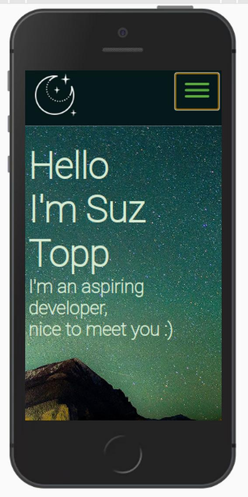
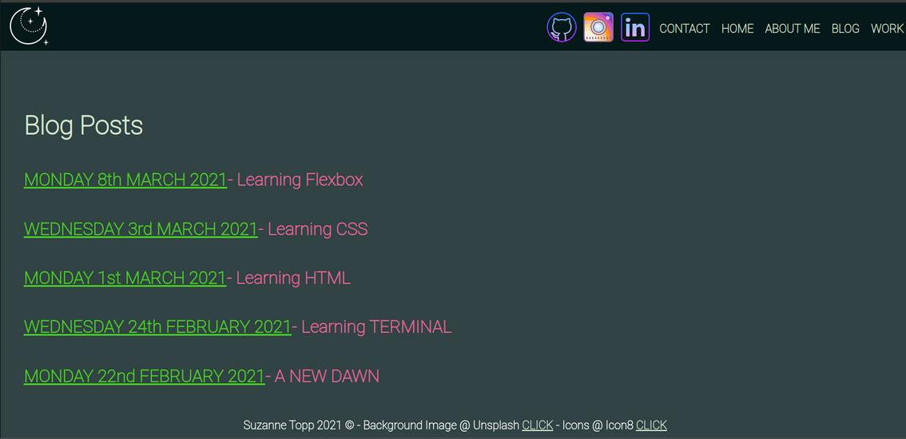

# PORTFOLIO WEBSITE

Link to Website:

Link to Github repository:

---

## SPECIFICATIONS

---

### **PURPOSE**

The purpose of this website is to act as an example and showcase of my work ethic, in progress skills and personality. It's directed at potential Development employers or recruiters.

### **FEATURES**

Main Pages

HOME - My Home Page is designed to show the most personality. It welcomes you to my site, tells you my name, and shows navigation to all other pages and social links.

ABOUT ME - The About Me page is designed to describe me and my personality. It shows the audience what I look like, as well as general information.

WORK/STUDY - The Work Study page touches on previous career work, current study work, and has a downloadable CV PDF.

BLOG POSTS - Place Holder pages showing what a single blog and blog list would look like eventually.
Blog Example 1
Blog Example 2
Blog Example 3
Blog Example 4
Blog Example 5

### **RESPONSIVENESS**

This website is mostly mobile and tablet responsive, which I will continue to improve over time. Text will change as sizing changes, and images will move as needed or be removed.

### **NAVIGATION**

The website uses a nav bar at the top of the page, which in desktop view has both icons and words, and in smaller views has a hamburger menu to house those links. There is also a clickable icon in the top left that will take you to the Home Page. The NavBar includes links to all pages on the site, as well as Github, LinkedIn, and Instagram.
All links are interactive in the sense that they show an underline and colour change when hovered over. This allows a user to know where they are navigating to.

### **ACCESSIBILITY**

The site has been audited via Lighthouse on Chrome Dev Tools.
Results are below.

IMAGE HERE

### **SRI**

A Sub Resource Integrity check has been added. This is a security measure.  
This was a final step after deploying the website, to provide secure use of the site's CSS and HTML.

### **DESIGN**

I spent some time originally working out what design theme I wanted to achieve. I am a huge fan of space and sci-fi, and therefore sourced my background image on UnSplash by searching similar key words. I like more over the top impactful designs, and that shows through on my Home Page.

Background Image 
 
Colour Palette 

I created wireframes in Figma, which were good initial inspiration. I did change a lot of the design as I went though to create a more user-friendly version of my initial vision.

**HOME PAGE WIREFRAMES**

**ABOUT ME PAGE WIREFRAMES**

**WORK PAGE WIREFRAMES**

**BLOG POSTS PAGE WIREFRAMES**

**BLOG POST SINGLE WIREFRAMES**

### **SITEMAP**

I create a sitemap of the site overall, to see how navigation would work.

### **FINAL OUTCOME**

The website changed quite a bit through the process, but where I got to in the end was an easier to navigate version. I utilised some single colour backgrounds to help with text readability.
I moved the socials up to the navbar so they could be in the hamburger drop down for ease.
I have struggled with responsiveness but have done a lot of work to get to where it is. I will continue to improve this as I learn. Eventually too I would like to add in icons for my skills, as I learn more developing, and to have a Projects page as opposed to a Blog page. The blog page for me will become obsolete eventually.

**HOME PAGE FINAL**

**ABOUT ME PAGE FINAL**

**WORK PAGE FINAL**

**BLOG POSTS PAGE FINAL**

**BLOG POST SINGLE FINAL**

**CONTACT PAGE FINAL**

### **TARGET AUDIENCE**

Potential Development employers, or recruiters. I want them to see that I have what it takes to get my start in the industry, and will follow through with the tech as I learn it.

### **TECH STACK**

HTML for content
CSS for design
JAVASCRIPT for hamburger menu (source https://www.harrisonmalone.dev/2021/03/navbars & https://github.com/harrisonmalone/navbar/blob/master/style.css)
Git and Github for version control
Netlify for deployment and hosting

### **IMAGE CREDITS**
